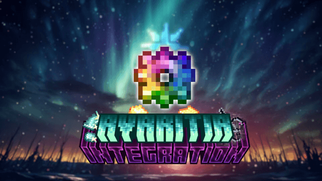

      

    
    
    

    <a href="https://github.com/Nova-Committee/avaritia-integration/blob/forge/1.20.1/README.md">English</a> | 
    <a href="https://github.com/Nova-Committee/avaritia-integration/blob/forge/1.20.1/README_CN.md">简体中文</a>

## **📕Introduction:**
* This mod add capability between Re:Avaritia and many other mods.

## **✏️Authors:**
- Programmer: `cnlimiter` `IAFEnvoy` `Frostbite-time` `Oganesson897` `cu6` `CreepingCreeper` `lostmyself8` `Lounode`
- Artist: `MHanHanBing` `Neo-Tix`

## **🔒License:**
- Code: [MIT](https://www.mit.edu/~amini/LICENSE.md)
- Assets: [CC BY-NC-SA 4.0](https://creativecommons.org/licenses/by-nc-sa/4.0/)

## **❗Attention:**
* You&nbsp; **DEFINITELY CAN** &nbsp;add the mod to your modpack.

## **🎮Capability**
* ✅: Fully Supported 
* 🚧: Partly Supported 
* 🔲: Planned Support 
* ❌: No Support Planned 

| Mod                           | Content | Status | Notes |
|-------------------------------|:--------|:------:|-------|
| Apotheosis                    |         |   🔲   |       |
| Applied Energistics 2         |         |   ✅   |       |
| Blood Magic                   |         |   ✅   |       |
| Botania                       |         |   ✅   |       |
| Create                        |         |   🚧   |       |
| Ender IO                      |         |   ✅   |       |
| GregTechCEu Modern            |         |   🔲   |       |
| Mekanism                      |         |   🔲   |       |
| Mekanism Advanced Generators  |         |   🔲   |       |
| NuclearCraft: Neoteric        |         |   🔲   |       |
| PneumaticCraft: Repressurized |         |   ✅   |       |
| Refined Storage               |         |   🚧   |       |
| SlashBlade                    |         |   ✅   |       |
| Tetra                         |         |   🔲   |       |
| Tinker's Construct 3          |         |   ✅   |       |
| Thermal Series                |         |   🚧   |       |